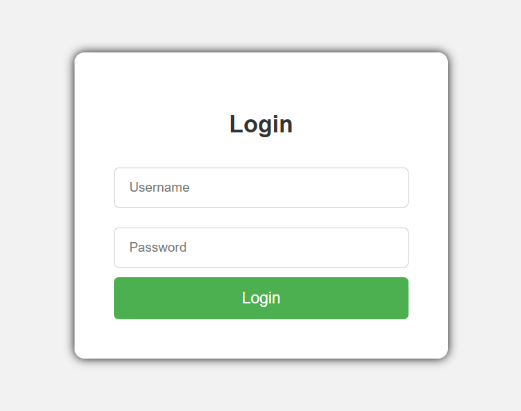

# Simple Login Form using HTML & CSS

This is a basic responsive login form built using pure HTML and CSS.

## 🔥 Features

- Clean and simple UI
- Responsive design
- Placeholder for username and password

## 📂 Technologies Used

- HTML5
- CSS3

## 👨‍💻 Author

- **Raj** - [@uspacial](https://github.com/uspacial)

## 📸 Screenshot

